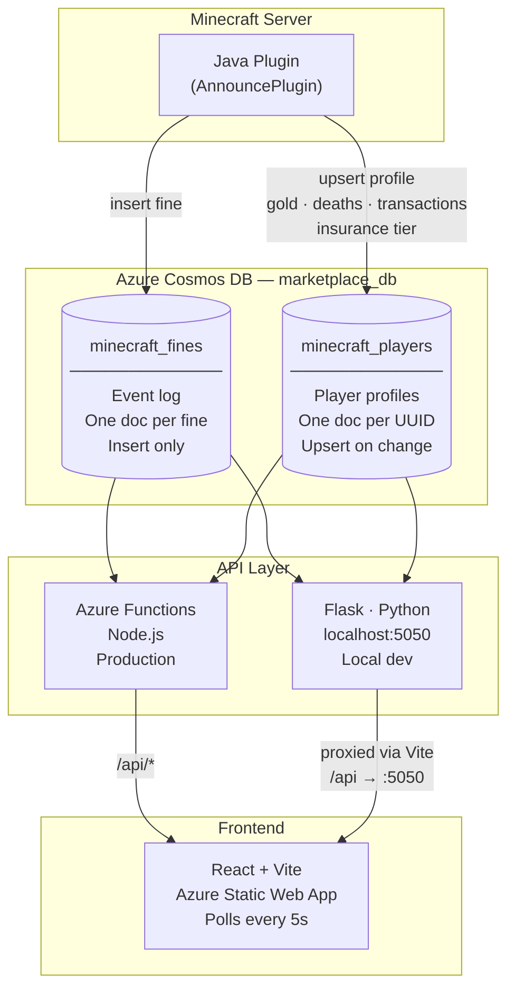

# minecraft-lan-party — Project Overview

## What This Is

A Minecraft LAN party management dashboard. A Java plugin running on the Minecraft server writes data to Azure Cosmos DB. A React frontend reads that data through an API layer and displays it in real time.

---

## Architecture



---

## Directory Structure

```
minecraft-lan-party/
├── api/                        # Production API — Azure Functions (Node.js)
│   ├── fines/                  # GET /api/fines
│   ├── fines_summary/          # GET /api/fines/summary
│   ├── host.json
│   └── package.json
├── local-dev/
│   ├── app.py                  # Local dev API — Flask mirrors Azure Functions
│   └── compose.yaml            # Docker config for server deployment
├── minecraft-fines/            # React frontend
│   ├── src/App.jsx
│   ├── vite.config.js          # Dev proxy: /api → localhost:5050
│   └── package.json
└── CLAUDE.md
```

---

## Running Locally

**Frontend:**
```bash
cd minecraft-fines
npm install
npm run dev         # http://localhost:5173
```

**API:**
```bash
cd local-dev
python3 -m venv venv
source venv/bin/activate
pip install flask flask-cors pymongo
python app.py       # http://localhost:5050
```

The Vite dev proxy (`vite.config.js`) forwards `/api/*` calls to `localhost:5050`, so the frontend works seamlessly against the local Flask server.

**Querying the DB directly (for testing):**
```bash
# from the Minecraft Dashboard folder with venv active
python3 check_players.py
```

---

## Database — Azure Cosmos DB (MongoDB API)

**Connection:** `marketplace_db` on Azure Cosmos DB, accessed via MongoDB wire protocol.

**Environment variable:** `COSMOS_CONN_STR` (used by Azure Functions in production; hardcoded in local `app.py` for dev).

---

### Collection: `minecraft_fines`

Immutable event log. Each document is a fine issued to a player. Never updated after creation.

```json
{
  "_id":        "ObjectId (string)",
  "playerName": "string",
  "playerUuid": "string (UUID)",
  "reason":     "string",
  "amount":     "number (schmeckles)",
  "paid":       "boolean",
  "collected":  "boolean",
  "timestamp":  "datetime"
}
```

---

### Collection: `minecraft_players`

Mutable player profile. One document per player UUID, upserted by the Java plugin as stats change.

```json
{
  "_id":                  "string (playerUuid)",
  "playerName":           "string",
  "playerUuid":           "string (UUID)",
  "gold":                 "number — raw nugget units (divide by 9, round for display)",
  "deaths":               "number — total death count",
  "transactionsSent":     "number — /pay or /request accepted as sender",
  "transactionsReceived": "number — /pay received or /request accepted as recipient",
  "insuranceTier":        "1 | 2 | 3 | null — null means no active insurance",
  "lastSeen":             "datetime",
  "joinDate":             "datetime"
}
```

**Gold unit system:**
- Nugget = 1 unit (1/9 gold)
- Ingot = 9 units (1 gold)
- Block = 81 units (9 gold)
- Display: `Math.round(nuggets / 9)` — always shown as whole number

Insurance tiers (1–3) are a planned plugin feature. Field stored as `null` until implemented.

---

## API Endpoints

| Method | Path | Description |
|--------|------|-------------|
| GET | `/api/fines` | Last 50 fines, sorted newest first |
| GET | `/api/fines/summary` | Per-player totals (amount owed, offence count) |
| GET | `/api/players` | *(planned)* All player profiles |
| GET | `/api/players/:uuid` | *(planned)* Single player profile |

---

## Frontend — Current Features

- Live polling every 5 seconds
- Stat cards: total fines, schmeckles owed, paid/unpaid counts
- Player totals table (sorted by total owed)
- Full fine log table with paid/collected status

## Frontend — Planned Features

- Player profiles view (gold, deaths, transactions, insurance tier)
- Gold leaderboard panel

---

## Java Plugin Integration Notes

- The plugin is the sole writer to Cosmos DB
- Player profiles are **upserted** on every join using `playerUuid` as the key
- Fine documents are **inserted** as new records — never mutated
- Gold is scanned every 10 seconds from inventory + tracked chests + placed gold blocks
- All DB writes are dispatched asynchronously to avoid blocking the game thread
- Pending gold requests are stored in memory only — they do not survive server restarts
